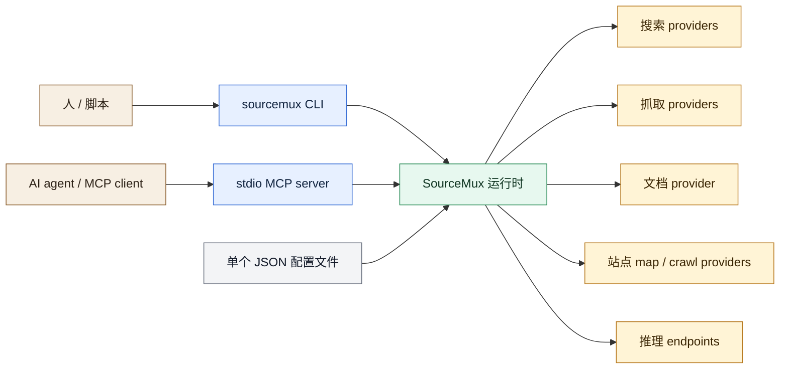
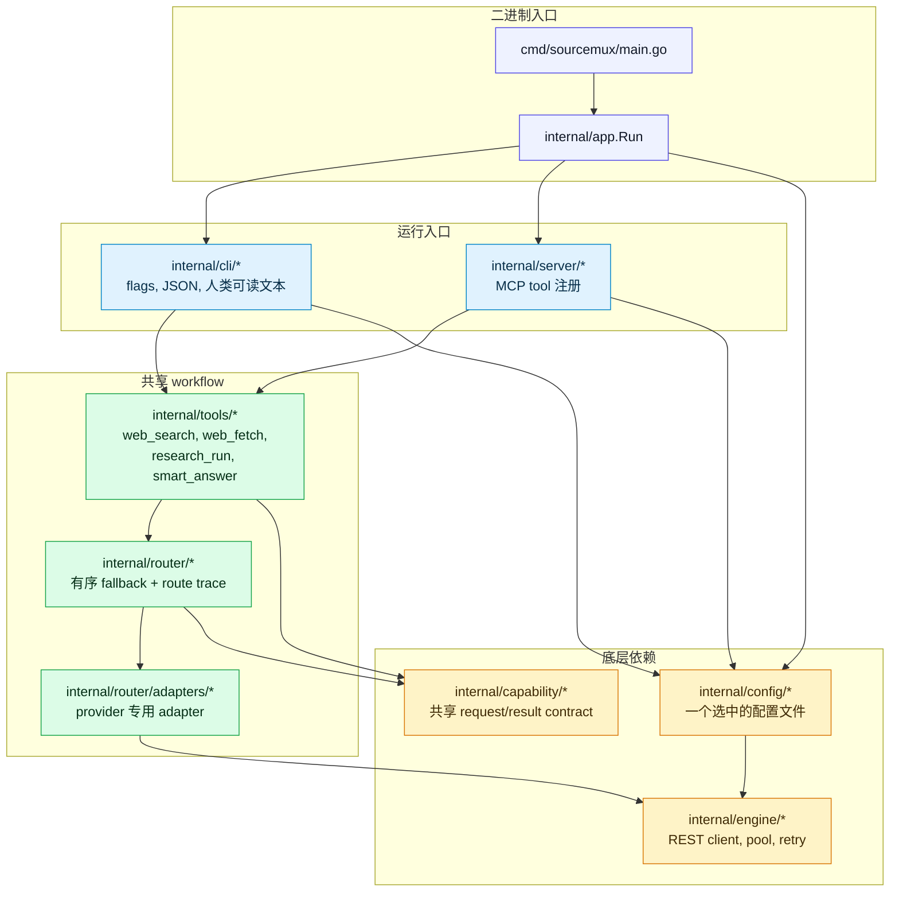
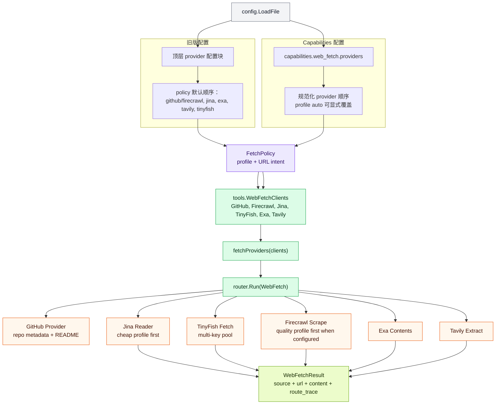
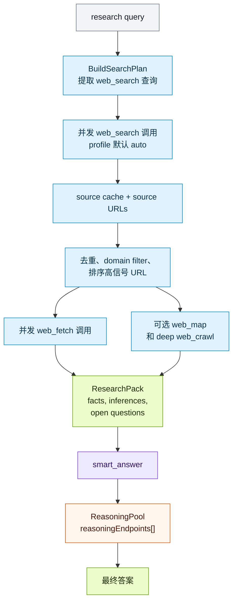
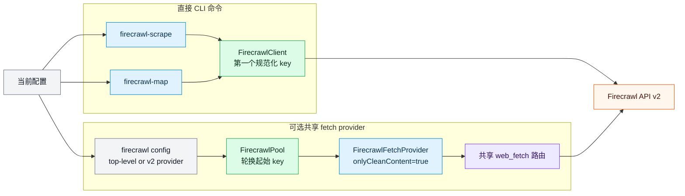

# SourceMux 架构

这份文档说明 SourceMux 的运行结构和 provider 路由。图用 Mermaid 写在仓库里，代码改了，路由也能在同一个变更里对齐。

## 阅读入口

SourceMux 是一个 Go 单文件二进制程序，有两个运行入口：

- 给人、脚本和生成的 agent skill 使用的 CLI。
- 给 agent client 使用的 stdio MCP server。

两个入口共用同一套配置加载、engine client 和大部分路由逻辑。可以按这条线读代码：

入口 -> 表层适配 -> 共享 tool workflow -> router -> provider adapter -> engine client

代码位置：

- 二进制入口：`cmd/sourcemux/main.go`
- CLI 和 MCP 的运行分流：`internal/app/app.go`
- CLI 分发：`internal/cli/cli.go`
- MCP server 组装：`internal/server/server.go`
- 配置加载：`internal/config/config.go`

## 运行层

CLI 和 MCP server 的输入、输出格式不同，但 search、fetch、research、synthesis 都会进入同一层共享 workflow。

边界如下：

- `internal/cli/providers.go` 构造 `tools.WebSearchClients` 和 `tools.WebFetchClients`。MCP 侧也拿到同一类 client 结构。
- `internal/tools` 放共享行为。上层 workflow 调 `RunWebSearch` 和 `RunWebFetch`，不重新写 provider 顺序。
- `internal/router` 负责 fallback 执行和 route trace。provider 请求如何组装，放在 adapter 或 engine client 里。
- `internal/engine` 放可复用 REST client、endpoint pool、retry 和结果格式处理。

## 能力路由

顶层 CLI 命令和 MCP tool 的路由方式并不完全一样。有的走 fallback router，有的是直接 provider 调用。

| 能力 | CLI 入口 | MCP 入口 | 路由 |
| --- | --- | --- | --- |
| 网页搜索 | `sourcemux search` | `web_search` | Grok pool -> TinyFish Search -> Exa Search -> Tavily Search |
| 网页抓取 | `sourcemux fetch` | `web_fetch` | policy-first fetch：GitHub URL 优先 repo-aware；普通网页默认 Firecrawl -> Jina -> Exa -> Tavily -> TinyFish；cheap profile 为 Jina-first |
| 文档搜索 | `sourcemux docs-search` | `docs_search` | Exa docs/web search fallback |
| Exa 高级接口 | `exa-search`, `exa-contents` | `exa_search_advanced`, `exa_contents_advanced` | 直接调用 Exa |
| 站点 map | `sourcemux map` | `web_map` | 直接调用 Tavily Map |
| 站点 crawl | `sourcemux crawl` | `web_crawl` | 直接调用 Tavily Crawl |
| Firecrawl scrape | `firecrawl-scrape` | 无专用 tool | 直接调用 Firecrawl CLI command |
| Firecrawl map | `firecrawl-map` | 无专用 tool | 直接调用 Firecrawl CLI command |
| Research | `sourcemux research` | `research_run` | Plan -> search -> source cache -> rank -> fetch -> 可选 map/crawl |
| Smart answer | `sourcemux smart-answer` | `smart_answer` | Research -> reasoning endpoint synthesis |

Firecrawl 这里有两层含义：

- 现在没有专用 Firecrawl MCP tool，也没有接入 Firecrawl MCP server。
- Firecrawl 可以参与普通 `fetch --profile auto`。条件是当前配置启用 Firecrawl 且带有 key；顶层 `firecrawl` 配置即可启用默认 quality-first 参与，v2 `capabilities.web_fetch.providers` 用来显式覆盖 auto 顺序。`research_run` 使用共享 fetch workflow，所以 research 的页面抓取也会跟随同一策略。

## Search 流程

Search 面向 source。它返回精简 MCP text 和 `session_id`；agent 可以继续调用 `get_sources` 取缓存的 source URL。

```mermaid
flowchart LR
    req["query + platform + profile"]:::input
    policy["SearchPolicy\n解析 default / auto / heavy"]:::policy
    router["router.Run(MainSearch)"]:::core

    grok["Grok pool\n按 profile 过滤 endpoints"]:::provider
    tiny["TinyFish Search"]:::provider
    exa["Exa Search"]:::provider
    tavily["Tavily Search"]:::provider

    cache["source cache\nsession_id -> URLs"]:::cache
    result["WebSearchResult\ncontent + route_trace"]:::output

    req --> policy --> router
    router --> grok
    grok -- 空结果 / 错误 / 超时 --> tiny
    tiny -- 空结果 / 错误 --> exa
    exa -- 空结果 / 错误 --> tavily
    grok -- 成功 --> cache
    tiny -- 成功 --> cache
    exa -- 成功 --> cache
    tavily -- 成功 --> cache
    cache --> result

    classDef input fill:#f3f4f6,stroke:#6b7280,color:#111827;
    classDef policy fill:#ede9fe,stroke:#7c3aed,color:#2e1065;
    classDef core fill:#dcfce7,stroke:#16a34a,color:#052e16;
    classDef provider fill:#fff7ed,stroke:#ea580c,color:#431407;
    classDef cache fill:#e0f2fe,stroke:#0284c7,color:#082f49;
    classDef output fill:#ecfccb,stroke:#65a30d,color:#1a2e05;
```

代码位置：

- 共享 search workflow：`internal/tools/search.go`
- Search provider 顺序：`internal/tools/search.go` 里的 `searchProviders`
- Profile 解析：`internal/tools/profile_policy.go` 里的 `ResolveSearchProfile`
- MCP source cache：`internal/server/server.go` 里的 `server.App.CacheSources` 和 `server.App.GetSources`

## Fetch 流程

Fetch 顺序来自 profile + URL intent + 可选 v2 显式顺序。`auto` 默认是 policy-first / quality-first；GitHub URL 先走 repo-aware provider，普通网页优先 Firecrawl，`cheap` profile 才是 Jina-first。

Firecrawl / profile fetch 规则：

- `fetch --profile auto`：GitHub repo/blob/tree/issues/releases URL 先走 GitHub Provider；普通网页默认 Firecrawl -> Jina -> Exa -> Tavily -> TinyFish。
- `fetch --profile quality`：普通网页走质量优先顺序。
- `fetch --profile cheap`：Jina -> Firecrawl -> Exa -> Tavily。
- V2：`capabilities.web_fetch.providers` 可显式指定 `auto` 的普通 provider 顺序。
- Firecrawl 只有在启用且带有 key 时才会实际参与；未配置时 provider 会被跳过。
- 共享 fetch 路由里，Firecrawl 使用 `FirecrawlPool`，每次轮换起始 key；遇到上游错误或空 markdown，会继续尝试剩余 key。
- 直接 `firecrawl-scrape` 和 `firecrawl-map` 当前通过 `buildFirecrawlClient` 使用第一个规范化后的 Firecrawl key。

代码位置：

- V1/V2 配置规范化：`internal/config/config.go`
- 共享 fetch workflow：`internal/tools/fetch.go`
- CLI fetch 命令：`internal/cli/fetch.go`
- Fetch adapters：`internal/router/adapters/fetch.go`
- Firecrawl pool 和 client：`internal/engine/firecrawl.go`

## Research 和 Smart Answer

`research` 与 `smart-answer` 是组合 workflow。它们不定义新的 search/fetch provider 顺序，而是复用共享 search 和 fetch 路径。

代码位置：

- Research executor 组装：`internal/tools/research.go` 里的 `NewResearchExecutor`
- CLI research 入口：`internal/cli/research.go`
- MCP research tool 注册：`internal/tools/research.go` 里的 `RegisterResearchRun`
- Smart answer 组合：`internal/tools/smart_answer.go`
- 推理 endpoint pool：`internal/engine/reasoning.go`

## Firecrawl 变更视图

Firecrawl 的接入范围很窄：直接 CLI 命令用于难抓页面和站点结构；顶层 `firecrawl` 配置启用后可以参与共享 fetch，v2 配置用于显式改写 provider 顺序。

当前边界：

- 已有专用 Firecrawl CLI 命令：`internal/cli/firecrawl.go`。
- `internal/server/server.go` 没有注册专用 Firecrawl MCP tool。
- 顶层 `firecrawl` 配置启用并带有 key 后，Firecrawl 可以参与 `web_fetch`；v2 配置可显式排序。
- 现有 `map` 和 `crawl` 仍由 Tavily 支撑。
- 现有 `search` 不包含 Firecrawl。
- Firecrawl 单元测试使用本地 test server，不能调用真实 Firecrawl API。

## Provider 矩阵

| Provider | 搜索 | 抓取 | 文档 | Map/Crawl | 推理 | 配置/key 说明 |
| --- | :---: | :---: | :---: | :---: | :---: | --- |
| Grok / OpenAI-compatible pool | 是 | 否 | 否 | 否 | 否 | `grokEndpoints[]`；search profiles 在这里配置 |
| TinyFish | fallback | fallback | 否 | 否 | 否 | `tinyfish.keys[]`；multi-key pool |
| Exa | fallback | fallback | 是 | 否 | 否 | `exa.apiKey`；也有 advanced direct tools |
| Tavily | fallback | fallback | 否 | 是 | 否 | `tavily.apiKey`；direct map/crawl |
| Jina Reader | 否 | cheap profile 第一位 / quality fallback | 否 | 否 | 否 | 可不带 key 使用 |
| Firecrawl | 否 | quality profile 第一位（配置 key 后） | 否 | 仅直接 CLI map | 否 | 直接 CLI 命令要求 `firecrawl.enabled=true`；共享 fetch 支持 policy-first 和显式 v2 provider 顺序 |
| Reasoning endpoints | 否 | 否 | 否 | 否 | 是 | `reasoningEndpoints[]`；只给 `smart_answer` 使用 |

## 更新规则

下面这些位置改动时，顺手更新这份文档：

- `internal/app/app.go`：顶层 command/server 路由。
- `internal/server/server.go`：MCP tool 注册或共享 client wiring。
- `internal/cli/cli.go` 或 `internal/cli/providers.go`：CLI command surface 或生产 client 构造。
- `internal/tools/*`：共享 search/fetch/research/smart-answer 行为。
- `internal/router/*` 或 `internal/router/adapters/*`：fallback 语义或 provider 顺序。
- `internal/config/config.go`：配置 schema、v1/v2 规范化、默认 provider 顺序、profile policy。
- `internal/engine/*`：provider client 行为、key pool、retry、输出 helper。
- `README.md`、`docs/AI_USAGE.md` 和示例配置：公开行为变化时同步。

判断标准很简单：只要 feature 改了 command 路由、MCP tool 暴露、provider fallback 顺序、配置 schema 或公开行为，就在同一个变更里更新相关图和 provider 矩阵行。
